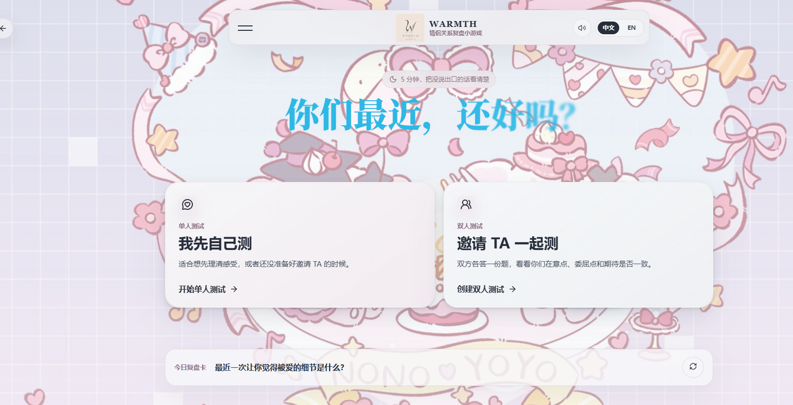

# WARMTH · 有温度阅览室

一个轻量、克制而有温度的情侣关系复盘小游戏。WARMTH 通过单人测试、双人邀请和关系反馈，把一次对话变成一次更容易开始的关系复盘。

> 这是一个关系沟通与自我觉察 Demo，不是心理诊断、伴侣咨询或专业心理治疗工具。

<p align="center">
  <a href="https://lover-test.vercel.app">在线体验</a> ·
  <a href="https://github.com/ChenShuo2004/AI-LOVE-test">GitHub</a> ·
  <a href="https://x.com/ChenshuoAI">关注作者</a>
</p>

<p align="center">
  
</p>

## 产品体验

WARMTH 适合在关系中出现“想聊聊，但不知道从哪里开始”的时刻。用户可以独立完成关系复盘，也可以邀请另一半共同参与；产品用关系天气、关系称号、今日复盘卡和给 TA 的一句话，将抽象感受转化为可继续讨论的线索。

## 核心功能

| 功能 | 说明 |
| --- | --- |
| 单人关系复盘 | 从个人视角整理当下的关系感受 |
| 双人邀请测试 | 通过邀请链接完成共同测试 |
| 关系天气 | 用轻量视觉反馈表达当前关系氛围 |
| 关系称号 | 根据测试结果生成有记忆点的关系标签 |
| 今日复盘卡 | 提供适合继续沟通的每日提示 |
| 给 TA 的一句话 | 把复盘结果落到一句具体表达 |

## 技术栈

- React · TypeScript · Vite
- Motion · GSAP
- Lucide React
- 前端独立运行，无需后端服务或真实 API Key

## 本地运行

```bash
git clone https://github.com/ChenShuo2004/AI-LOVE-test.git
cd AI-LOVE-test
npm install
npm run dev
```

打开终端显示的本地地址即可开始体验。

常用命令：

```bash
npm run typecheck
npm run build
npm run preview
```

## 环境变量

项目默认不依赖后端服务和真实密钥。如需使用本地配置，可参考 `.env.example` 创建 `.env.local`。

## 设计原则

- 让关系复盘足够轻，不制造额外压力
- 让结果足够具体，能够自然引出下一句话
- 用动画和视觉节奏传递温度，但不喧宾夺主
- 不把复杂关系简化成单一分数或结论

## 作者

由 [陈硕（KAI）](https://github.com/ChenShuo2004) 构建。

- X / Twitter：[@ChenshuoAI](https://x.com/ChenshuoAI)
- 在线产品：[lover-test.vercel.app](https://lover-test.vercel.app)

## 免责声明

WARMTH 仅用于关系沟通、轻量复盘和自我觉察。测试结果不代表客观关系诊断，也不应替代心理咨询、伴侣咨询或其他专业服务。
